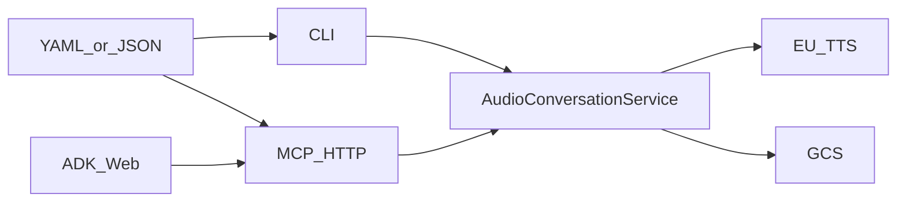

# AGENTS.md

Orientation for agents changing this Python package. To *create audio*, follow [`.agents/skills/audio-conversation/SKILL.md`](.agents/skills/audio-conversation/SKILL.md) and [`docs/creating-audio.md`](docs/creating-audio.md). Library facade: [`docs/library-api.md`](docs/library-api.md). Design rationale: [`docs/gcp-design.md`](docs/gcp-design.md). Synthesis batching: [`docs/synthesis.md`](docs/synthesis.md). Overview: [`README.md`](README.md).

## Stack

Hatchling **src layout**, Python **>=3.11**, package `tts_audio_conversation`. Install with `uv sync --extra dev` (or `--extra dev --extra adk` / `--all-extras`). Copy [`.env.example`](.env.example) to `.env` for GCP. Shared synthesis lives in `logic/`; CLI, MCP, and the ADK Web adapter are thin adapters over `AudioConversationService` (ADK talks to MCP HTTP, not TTS directly).

## Where to change what

- [`src/tts_audio_conversation/logic/service.py`](src/tts_audio_conversation/logic/service.py) — public facade + factory
- [`src/tts_audio_conversation/logic/models.py`](src/tts_audio_conversation/logic/models.py) — YAML/JSON script schema (`ConversationScript`)
- [`src/tts_audio_conversation/logic/jobs/`](src/tts_audio_conversation/logic/jobs/) — table-driven FSM, `ConversationCreationJob`, `JobManager`
- [`src/tts_audio_conversation/logic/pipeline.py`](src/tts_audio_conversation/logic/pipeline.py) — voices → TTS → upload
- [`src/tts_audio_conversation/logic/tts.py`](src/tts_audio_conversation/logic/tts.py) / [`batching.py`](src/tts_audio_conversation/logic/batching.py) — EU TTS + turn packing (`MAX_BATCH_CHARS=1500`)
- [`src/tts_audio_conversation/logic/translator.py`](src/tts_audio_conversation/logic/translator.py) — Cloud Translation (`translate-eu`, `europe-west1`)
- [`src/tts_audio_conversation/logic/storage.py`](src/tts_audio_conversation/logic/storage.py) — GCS upload/download/delete (no residency checks)
- [`src/tts_audio_conversation/logic/settings.py`](src/tts_audio_conversation/logic/settings.py) — env (`GOOGLE_CLOUD_PROJECT`, `AUDIO_CONVERSATION_*`, MCP bind, OTEL)
- [`src/tts_audio_conversation/cli/`](src/tts_audio_conversation/cli/) — Click adapter (`uv run tts-audio-conversation`)
- [`src/tts_audio_conversation/mcp/server.py`](src/tts_audio_conversation/mcp/server.py) — FastMCP HTTP tools at `/mcp` (thin adapter; jobs live in `logic/jobs/`)
- [`src/tts_audio_conversation/adk/`](src/tts_audio_conversation/adk/) — ADK `LlmAgent` playground (`adk web`), REST (`adk api_server`), and A2A (`a2a.py`; optional extra `google-adk[a2a]>=2.0.0`)
- [`templates/`](templates/) — long-form sample scripts (slow live tests)
- [`tests/unit/`](tests/unit/) — **unit** (mocked GCP: logic / cli / mcp; ADK tools/plugin/client — no `adk api_server` process)
- [`tests/integration/`](tests/integration/) — **live** library facade / leaf GCP / real `adk api_server` (Gemini; MCP may be mocked)
- [`tests/e2e/`](tests/e2e/) — **live** CLI + MCP HTTP adapters
- Config: [`pyproject.toml`](pyproject.toml), [`.github/workflows/ci.yml`](.github/workflows/ci.yml)



## Quality gate (match CI)

```bash
uv run ruff check .
uv run ruff format --check .
uv run mypy src tests
uv run pytest -m unit --cov=src/tts_audio_conversation --cov-fail-under=85
```

CI installs with `uv sync --extra dev --extra adk` so the ADK↔MCP wiring tests can import `google.adk`.

Format in place with `uv run ruff format .`. Optional: `uv run pre-commit run --all-files`.

Ruff: line length 100, Google pydocstyle; ignores `D100`/`D104`/`D107`. Mypy is `strict`.

## Tests

Markers in [`pyproject.toml`](pyproject.toml); auto-applied in [`tests/conftest.py`](tests/conftest.py) from path: `tests/unit/` → `unit`, `tests/integration/` → `integration`, `tests/e2e/` → `e2e`. Nodeids matching unicorn / German AI / `test_mcp_long` also get `slow`.

| Intent | Command | When |
| --- | --- | --- |
| Default / CI | `uv run pytest -m unit --cov=… --cov-fail-under=85` | Always after code changes |
| Live library + ADK | `uv run pytest -m "integration and not slow"` | ADC + `.env`; billed GCP; ADK tests spawn the real `adk api_server` REST process (Gemini; MCP may be mocked) |
| Live adapters | `uv run pytest -m "e2e and not slow"` | ADC + staging bucket |
| Long-form (4 tests) | `uv run pytest -m slow -n 4` | **Always** use `-n 4` (pytest-xdist); only if the user asks |

ADK layers: [`tests/unit/adk/`](tests/unit/adk/) covers ingest/create tools, the LRO plugin, MCP client, `RetryingMcpToolset`, and `to_a2a` ASGI app wiring without spawning `adk api_server`. [`tests/integration/adk/`](tests/integration/adk/) uses the real CLI (`python -m google.adk.cli api_server`) or live A2A TCP server. Boot smoke uses a dummy MCP URL; the Gemini LRO test uses mocked MCP HTTP + fake TTS/GCS. Pointing that same API server at live MCP is a later e2e-style suite.

### Slow / long-form (parallel)

There are **four** `slow` tests (2 library + 2 MCP), each synthesizing a full [`templates/`](templates/) script (~8–15 min of TTS). They use unique GCS prefixes and free ports, so they are safe under xdist.

```bash
# Wall-clock ≈ one long job (~8–15 min), not 4× sequential (~hour)
uv run pytest -m slow -n 4
```

Do **not** run `pytest -m slow` without `-n` unless debugging a single failure. Prefer `-n 4` (one worker per test) over `-n auto`. If TTS quota throttles, drop to `-n 2`. Env: `GOOGLE_CLOUD_PROJECT`, `AUDIO_CONVERSATION_GCS_STAGING_BUCKET` (MCP), `AUDIO_CONVERSATION_TEST_GCS_URI` (integration). Billed GCP.

Live tests skip unless those vars are set. Delete GCS blobs in `finally` unless `KEEP_TEST_ARTIFACTS=true`. Do not commit `*.wav`, `*.mp3`, or `.env`. More detail: [`docs/creating-audio.md`](docs/creating-audio.md#live-and-slow-tests).

## Invariants

- TTS only via `eu-texttospeech.googleapis.com`; Translation only via `translate-eu.googleapis.com` / `europe-west1`. Callers own EU bucket choice (no write-time residency checks).
- Official `TextToSpeechClient.synthesize_speech` + `multi_speaker_markup`. Never `synthesizeLongAudio`.
- Speaker aliases `[a-zA-Z0-9]+`. Voice names must contain `Chirp3-HD`. `list_voices` on synthesize/start only.
- One-speaker scripts get an unused Companion persona.
- Batch turns at ≤1500 characters. Retry each `synthesize_speech` with GAPIC `retry.Retry`. Translation batches at 8000 characters per RPC.
- Public processing after upload takes `gs://` script URIs only. Audio creation is async-job only.
- MCP `start_conversation` may write `status.json` (`queued`) and call `list_voices`, but must return before `synthesize_speech`. Single Uvicorn worker.
- No stale auto-fail / no TTS resume. Cancel after restart writes GCS `cancelled` only.
- Project flag is `--project` (not `--project-id`).
- Adapters must not call `batch_turns`, `assert_voices_*`, translator, or TTS directly — only `AudioConversationService`. The ADK adapter additionally talks to MCP HTTP (and GCS download via the library storage helper); it must not call TTS or Translation APIs itself.
