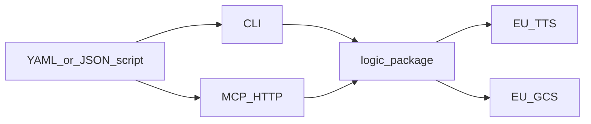

# AGENTS.md

Orientation for agents changing this Python package. To *create audio*, follow [`.agents/skills/audio-conversation/SKILL.md`](.agents/skills/audio-conversation/SKILL.md) and [`docs/creating-audio.md`](docs/creating-audio.md). Product invariants: [`.agents/rules/gcp-eu-sovereignty.md`](.agents/rules/gcp-eu-sovereignty.md). Design rationale: [`docs/gcp-design.md`](docs/gcp-design.md). Synthesis batching: [`docs/synthesis.md`](docs/synthesis.md). Overview: [`README.md`](README.md).

## Stack

Hatchling **src layout**, Python **>=3.11**, package `tts_audio_conversation`. Install with `uv sync --extra dev` (or `--all-extras`). Copy [`.env.example`](.env.example) to `.env` for GCP. Shared synthesis lives in `logic/`; CLI and MCP wrap it.

## Where to change what

- [`src/tts_audio_conversation/logic/models.py`](src/tts_audio_conversation/logic/models.py) — YAML/JSON script schema (`ConversationScript`)
- [`src/tts_audio_conversation/logic/client.py`](src/tts_audio_conversation/logic/client.py) — EU TTS (`EU_TTS_ENDPOINT`, `MAX_BATCH_CHARS=1500`)
- [`src/tts_audio_conversation/logic/translator.py`](src/tts_audio_conversation/logic/translator.py) — Cloud Translation (`translate-eu`, `europe-west1`)
- [`src/tts_audio_conversation/logic/storage.py`](src/tts_audio_conversation/logic/storage.py) — GCS upload/download/delete
- [`src/tts_audio_conversation/logic/auth.py`](src/tts_audio_conversation/logic/auth.py) — ADC + project resolution
- [`src/tts_audio_conversation/logic/settings.py`](src/tts_audio_conversation/logic/settings.py) — env (`GOOGLE_CLOUD_PROJECT`, `AUDIO_CONVERSATION_GCS_STAGING_BUCKET`, MCP bind, OTEL)
- [`src/tts_audio_conversation/cli/`](src/tts_audio_conversation/cli/) — Click: `template`, `validate`, `voices`, `translate`, `synthesize`, `download` (`uv run tts-audio-conversation`; alias `audio-conversation`)
- [`src/tts_audio_conversation/mcp/server.py`](src/tts_audio_conversation/mcp/server.py) — FastMCP HTTP tools at `/mcp`
- [`src/tts_audio_conversation/mcp/jobs.py`](src/tts_audio_conversation/mcp/jobs.py) — background jobs, cancel, concurrency
- [`templates/`](templates/) — long-form sample scripts (slow live tests)
- [`tests/logic/`](tests/logic/), [`tests/cli/`](tests/cli/), [`tests/mcp/`](tests/mcp/) — **unit** (mocked GCP)
- [`tests/integration/`](tests/integration/) — **live** EU GCP
- [`docs/creating-audio.md`](docs/creating-audio.md) — setup, CLI, MCP
- [`docs/synthesis.md`](docs/synthesis.md) — batching and WAV stitch
- [`docs/gcp-design.md`](docs/gcp-design.md) — why these GCP APIs
- Config: [`pyproject.toml`](pyproject.toml), [`.github/workflows/ci.yml`](.github/workflows/ci.yml)



## Quality gate (match CI)

After code changes, run the same commands as [`.github/workflows/ci.yml`](.github/workflows/ci.yml):

```bash
uv run ruff check .
uv run ruff format --check .
uv run mypy src tests
uv run pytest -m unit
```

Format in place with `uv run ruff format .`. Optional: `uv run pre-commit run --all-files`.

Ruff: line length 100, Google pydocstyle; ignores `D100`/`D104`/`D107`. Mypy is `strict`. VS Code formats with Ruff and runs pytest `-m unit`.

## Tests

Markers are declared in [`pyproject.toml`](pyproject.toml) and auto-applied in [`tests/conftest.py`](tests/conftest.py): paths under `tests/integration/` get `integration`; everything else gets `unit`. Nodeids matching unicorn / German AI / `test_mcp_long` also get `slow`.

| Intent | Command | When |
| --- | --- | --- |
| Default / CI | `uv run pytest -m unit` | Always after code changes |
| Live EU smoke | `uv run pytest -m "integration and not slow"` | ADC + `.env`; billed GCP |
| Long-form (~15 min each) | `uv run pytest -m slow` | Only if the user asks |

Live tests skip unless `GOOGLE_CLOUD_PROJECT` and `AUDIO_CONVERSATION_TEST_GCS_URI` are set (MCP live tests also use `AUDIO_CONVERSATION_GCS_STAGING_BUCKET`). Delete GCS blobs in `finally` unless `KEEP_TEST_ARTIFACTS=true`. Do not commit `*.wav`, `*.mp3`, or `.env`.

## Invariants

Full list: [`.agents/rules/gcp-eu-sovereignty.md`](.agents/rules/gcp-eu-sovereignty.md).

- TTS only via `eu-texttospeech.googleapis.com`; Translation only via `translate-eu.googleapis.com` / `europe-west1`; GCS buckets on the EU allowlist (`EU`, `EUR4`, and the listed `europe-*` regions in `is_eu_bucket_location`; enforced on writes).
- Official `TextToSpeechClient.synthesize_speech` + `multi_speaker_markup`. Never `synthesizeLongAudio`.
- Speaker aliases `[a-zA-Z0-9]+`. Voice names must contain `Chirp3-HD`. `list_voices` on synthesize/start_conversation only.
- One-speaker scripts get an unused Companion persona.
- Batch turns at ≤1500 characters. Retry each `synthesize_speech` with GAPIC `retry.Retry`. Translation batches at 8000 characters per RPC.
- MCP `start_conversation` may write `status.json` (`queued`) and call `list_voices`, but must return before `synthesize_speech`. Single Uvicorn worker; do not scale the process horizontally.
- Stale `queued`/`running` jobs (30 min, no heartbeat) become `failed`; no TTS resume. Cancel after restart writes GCS `cancelled` only.
- Project flag is `--project` (not `--project-id`).
