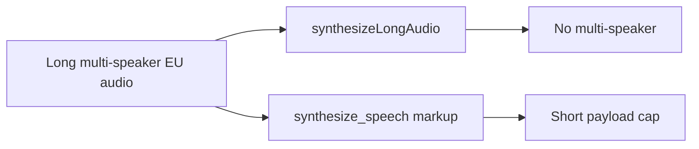
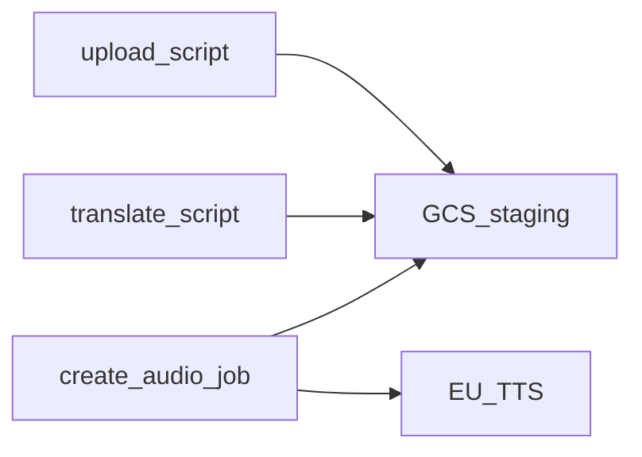
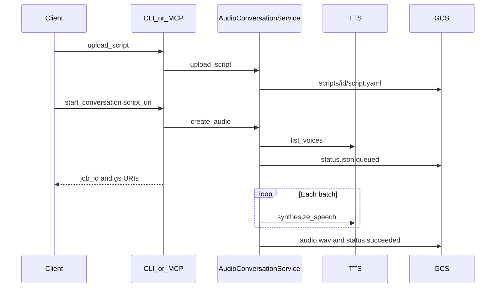

# Agentic Audio Conversations

Generate spoken **audio conversations** from a YAML (or JSON) script using Google Cloud **Chirp 3 HD** Text-to-Speech, with **EU ML processing** on regional endpoints. Synthesis and translation use EU TTS/Translation APIs; stage scripts and audio on an EU GCS bucket you configure.

Agents and humans share one library facade: `AudioConversationService`. The **CLI** and **FastMCP HTTP** server are thin adapters over the same upload → translate → job flow.

## The problem

Cloud TTS can sound like a two-person conversation, but the APIs do not line up with a long, sovereign, agent-driven episode:

1. **Multi-speaker and long-form are different RPCs.** `synthesizeLongAudio` handles length, not dialogue. `synthesize_speech` with `multi_speaker_markup` handles Chirp 3 HD conversation, not a 15-minute script in one call (payloads much above ~1500 characters often `502` / `504`).
2. **Global TTS is not EU processing.** Default Text-to-Speech and Translation endpoints are not the EU regional ones.
3. **Agents cannot wait on TTS.** A blocking MCP tool that runs for minutes is unusable. Jobs must return a `job_id` immediately.

## What this repo does

It treats Cloud TTS as a **batch engine**, not a one-shot renderer:

- Official `TextToSpeechClient.synthesize_speech` + `multi_speaker_markup` on `eu-texttospeech.googleapis.com`
- Turns packed at ≤1500 characters, GAPIC retry per batch, LINEAR16 WAV stitched locally
- Translation on `translate-eu.googleapis.com` / `europe-west1`
- Scripts and jobs staged under `…/conversation/scripts/…` and `…/conversation/jobs/…`
- Same orchestration for CLI and MCP: upload → optional translate → async job; MCP returns before `synthesize_speech`

## Documentation

| Doc | Contents |
| --- | --- |
| [`docs/creating-audio.md`](docs/creating-audio.md) | Setup, script schema, CLI, MCP tools |
| [`docs/library-api.md`](docs/library-api.md) | `AudioConversationService` quickstart |
| [`docs/synthesis.md`](docs/synthesis.md) | Batching, stitching, Companion voice, retries |
| [`docs/gcp-design.md`](docs/gcp-design.md) | Why these GCP APIs and EU endpoints |
| [`AGENTS.md`](AGENTS.md) | Layout, quality gate, which tests to run |
| [`.agents/skills/audio-conversation/SKILL.md`](.agents/skills/audio-conversation/SKILL.md) | Agent skill for producing episodes |

## Develop

Python ≥3.11, `uv sync --all-extras`. Copy [`.env.example`](.env.example). Quality commands and test markers: [`AGENTS.md`](AGENTS.md). License: Apache-2.0.
