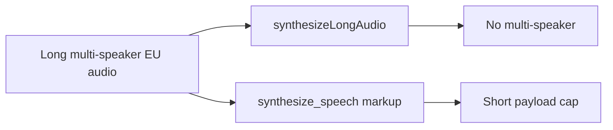
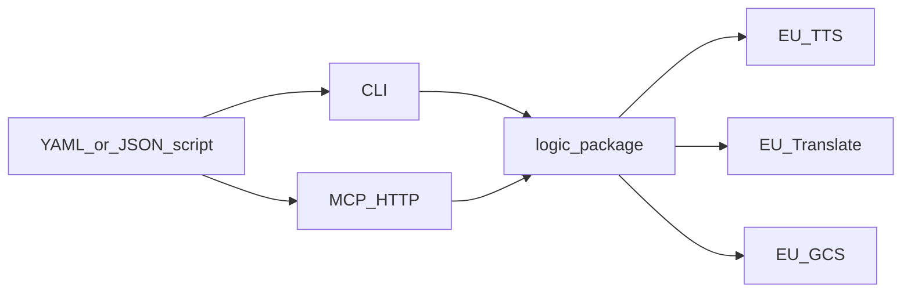
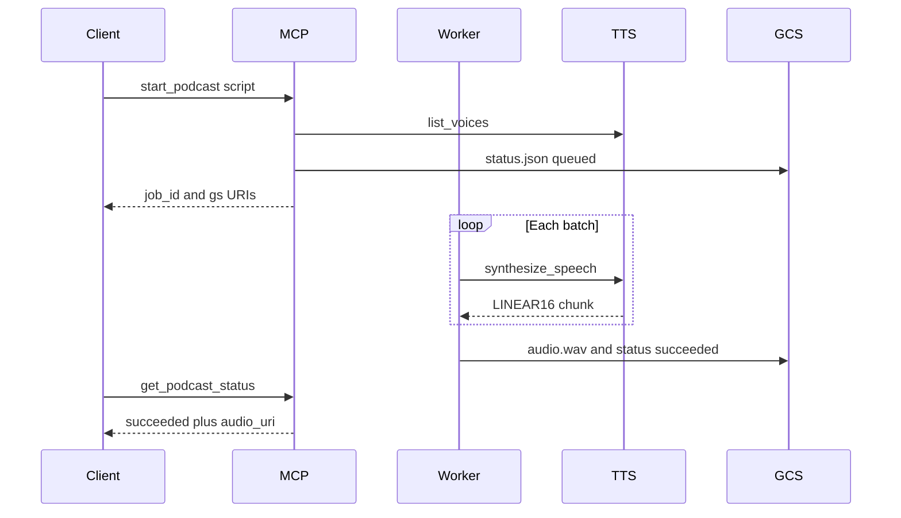

# TTS Podcast Creator

Turn a YAML or JSON dialogue into spoken audio with Google Cloud **Chirp 3 HD** voices, while keeping **synthesis, translation, and stored audio in the EU**.

Agents and humans share one library (`src/tts_podcast_creator/logic`). A **CLI** writes a local WAV; a **FastMCP HTTP** server starts the same work as a background job and leaves the file on an EU GCS bucket.

## The problem

Cloud TTS can sound like a two-person show, but the APIs do not line up with a long, sovereign, agent-driven podcast:

1. **Multi-speaker and long-form are different RPCs.** `synthesizeLongAudio` handles length, not dialogue. `synthesize_speech` with `multi_speaker_markup` handles Chirp 3 HD conversation, not a 15-minute script in one call (payloads much above ~1500 characters often `502` / `504`).
2. **Global TTS is not EU processing.** Default Text-to-Speech and Translation endpoints are not the EU regional ones. A US GCS bucket would also break residency for the audio at rest.
3. **Agents cannot wait on TTS.** A blocking MCP tool that runs for minutes is unusable. Jobs must return a `job_id` immediately and survive a process crash without pretending they can resume billed batches.

## What this repo does

It treats Cloud TTS as a **batch engine**, not a one-shot renderer:

- Official `TextToSpeechClient.synthesize_speech` + `multi_speaker_markup` on `eu-texttospeech.googleapis.com`
- Turns packed at ≤1500 characters, GAPIC retry per batch, LINEAR16 WAV stitched locally
- Translation on `translate-eu.googleapis.com` / `europe-west1`
- Writes only to GCS buckets in `EU`, `EUR4`, or `europe-*`
- MCP `start_podcast` returns before `synthesize_speech`; status is polled; audio is fetched from GCS by the caller

Single-speaker narration is supported: Cloud TTS still needs two speaker definitions, so an unused **Companion** voice is injected.

## Documentation

| Doc | Contents |
| --- | --- |
| [`docs/creating-audio.md`](docs/creating-audio.md) | Setup, script schema, CLI, MCP tools, troubleshooting |
| [`docs/synthesis.md`](docs/synthesis.md) | Batching, stitching, Companion voice, retries, cancel |
| [`docs/gcp-design.md`](docs/gcp-design.md) | Why these GCP APIs and EU endpoints, not Long Audio or global TTS |
| [`AGENTS.md`](AGENTS.md) | Layout, quality gate, which tests to run |
| [`.agents/skills/podcast-creator/SKILL.md`](.agents/skills/podcast-creator/SKILL.md) | Agent skill for producing episodes |

## Develop

Python ≥3.11, `uv sync --all-extras`. Copy [`.env.example`](.env.example). Quality commands and test markers: [`AGENTS.md`](AGENTS.md). License: Apache-2.0.
