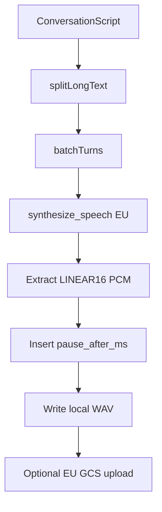

# Synthesis pipeline

How a dialogue script becomes one LINEAR16 WAV, and why it is not a single Cloud TTS RPC.

## Constraint

Cloud TTS `synthesizeLongAudio` is the long-form API, but it **cannot** do multi-speaker markup. Chirp 3 HD dialogue needs `TextToSpeechClient.synthesize_speech` with `multi_speaker_markup` (`gemini-2.5-flash-tts`). That RPC is reliable around **1500 characters**; larger payloads often return `502` / `504`.

This package therefore **batches** turns, retries each RPC independently, and **stitches** PCM locally.

## Batching

- Pack consecutive turns until the next turn would exceed `MAX_BATCH_CHARS` (1500)
  or Gemini's MultiSpeakerMarkup UTF-8 byte cap (4000 bytes, including speaker/text
  framing overhead).
- A turn longer than either limit is split on word boundaries first; `pause_after_ms`
  stays on the last fragment.
- A non-null `pause_after_ms` **flushes** the current batch so silence can be inserted between Cloud responses (not inside one markup).

Between batches, silence is inserted: the last turn’s `pause_after_ms`, or 300 ms by default.

## Voices

Speaker aliases must be `[a-zA-Z0-9]+` (Cloud TTS constraint). Names must contain `Chirp3-HD`.

`MultiSpeakerVoiceConfig` requires **at least two** speaker definitions. A one-speaker script gets an unused **Companion** persona (`Aoede` or `Fenrir`, whichever is not the primary). Companion is never given a turn.

CLI `synthesize` and MCP `start_conversation` call EU `list_voices` and fail if a name (including Companion) is missing. `validate` / `validate_script` only check the `Chirp3-HD` substring.

## Retries and cancel

Each `synthesize_speech` call uses GAPIC `retry.Retry` (429, 502, 503, 504, and similar). There is no extra retry loop around the whole episode.

Cancel is **cooperative between batches**. An in-flight RPC (~25–30s) may finish; later batches are skipped and the WAV is not kept. MCP cancel after a process restart only writes `cancelled` to GCS — it does not resume or start a worker.

## Encoding

The script may declare `audio_encoding`, but synthesis always writes **mono 16-bit LINEAR16 WAV** at `sample_rate_hertz` (default 24000). That encoding is what stitching expects.

Translation (optional) batches `translate_text` at 8000 characters per RPC and remaps Chirp 3 voice locale prefixes (`en-US-Chirp3-HD-Fenrir` → `de-DE-Chirp3-HD-Fenrir`). Design notes: [`gcp-design.md`](gcp-design.md).
